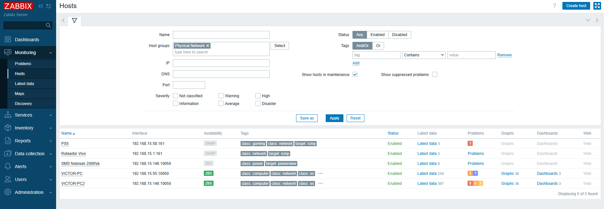
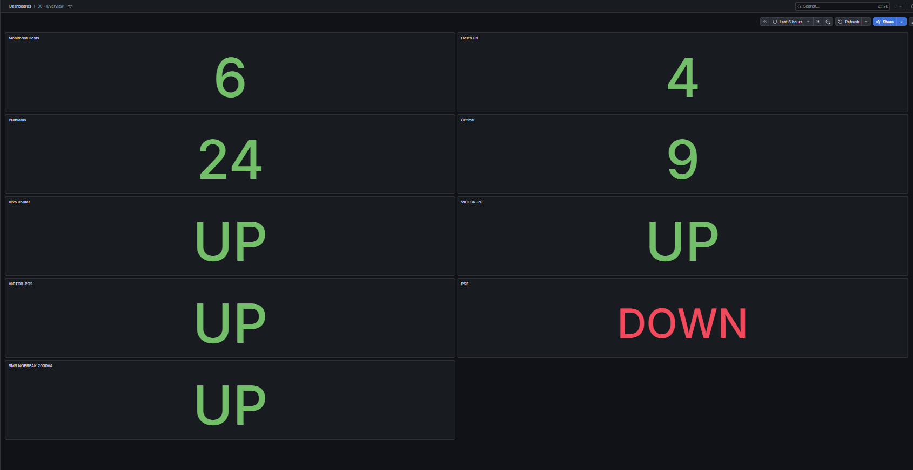
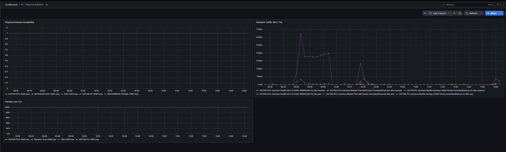
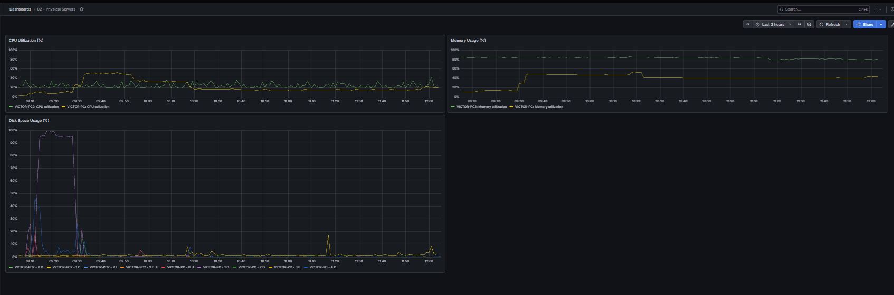
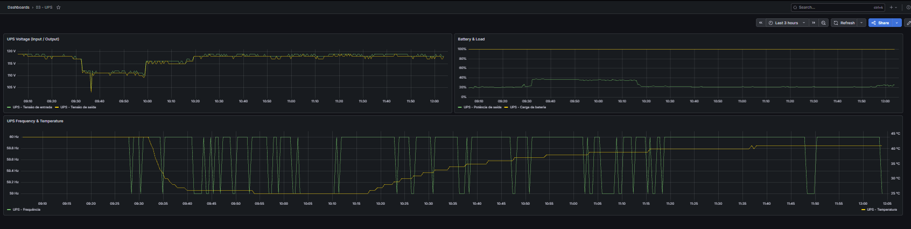
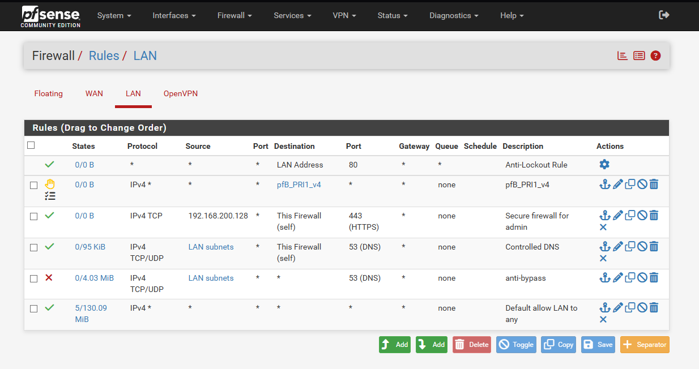
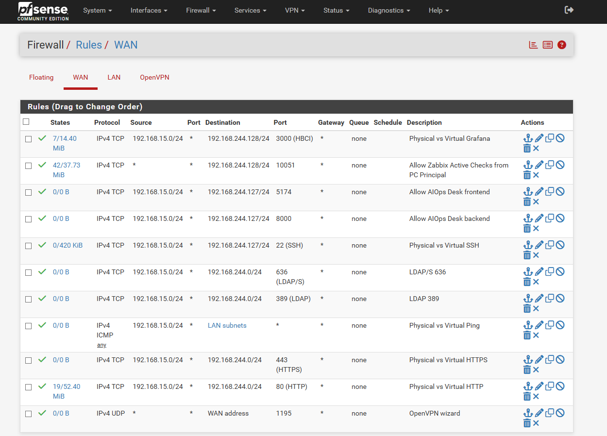

# 🚀 Monitoring & Observability Lab: Physical Network (Zabbix, Grafana & pfSense)

[🇺🇸 English](README.md) | [[🇧🇷 Português](README-PT.md)]

Laboratory project developed to integrate, monitor, and ensure the observability of a physical network and its devices using a centralized architecture with **Zabbix**, **Grafana**, and **pfSense**. The environment simulates a real-world enterprise infrastructure scenario, running distributed across virtual and secondary machines while being accessed securely from a primary workstation.

---

## 📐 Architecture & Documentation
For a complete understanding of the topology, data flow, and network ports used in this lab, check the documentation:
* [English Architecture Documentation](docs/architecture.md)
* [Documentação de Arquitetura em Português](docs/architecture-pt.md)

---

## 🛠️ Technologies Used
* **Zabbix Server:** Centralized metrics collection, availability monitoring (ICMP/Ping), SNMP, and active agents.
* **Grafana:** Custom dashboards and real-time visualization (Status panels, network traffic, server resources, and UPS telemetry).
* **pfSense:** Advanced firewall management, routing rules, NAT, and edge security between networks.
* **Virtualization:** Distributed architecture simulating production environments.

---

## 📸 Environment & Dashboards Demo

### 1. Hosts Inventory (Zabbix)
Central dashboard of monitored hosts in the physical network:

### 2. Overview (Grafana Dashboard)
Consolidated panel showing overall node availability status (`UP/DOWN`):

### 3. Network Traffic & Packet Loss
Traffic metrics (RX/TX) and connection stability:

### 4. Server Monitoring (CPU, Memory, and Disk)
Real-time hardware resource tracking:

### 5. Power Telemetry (UPS / Battery)
Monitoring input/output voltage, battery load, and temperature:

### 6. Firewall Configurations (pfSense)
Security rules configured on LAN and WAN interfaces for traffic and remote access:
* **LAN Rules:** 
* **WAN Rules:** 

---

## ⚙️ Key Configurations Implemented
* **pfSense Firewall Rules:** Port forwarding and specific traffic mapping for Zabbix Active Checks, Grafana requests, and ICMP packets.
* **Custom Dashboards:** Creation of modular Grafana panels focused on quick visibility of operational incidents.

---

## 🚀 How to Set Up / Replicate
1. Set up **pfSense** on a virtual machine (or edge firewall) isolating networks and creating traffic allowance rules.
2. Deploy the **Zabbix Server**, register local hosts, and validate communication via SNMP and Zabbix Agents.
3. Connect **Grafana** using the Zabbix data source plugin and import or build your custom panels.